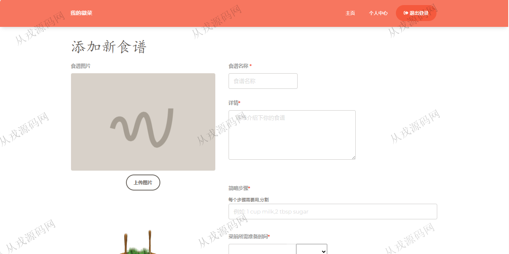
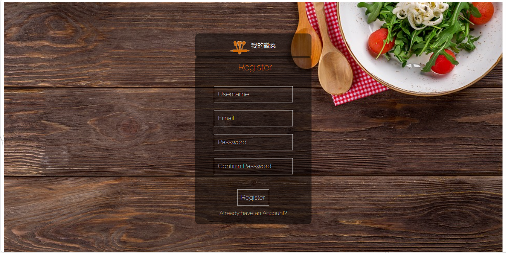

<h1 align="center">121.徽菜馆饭店管理系统</h1>

 获取sql文件 QQ: 386869957 QQ群: 377586148 

 [推荐站点: 从戎源码网](https://armycodes.com/) 

## 简介

> 本代码来源于网络,仅供学习参考使用!
>
> 提供1.远程部署/2.修改代码/3.设计文档指导/4.框架代码讲解等服务
> 
> 访问地址：http://localhost:8080/home
> 
> 用户名密码：123@qq.com 12345678
> 

## 项目介绍
基于springboot的徽菜馆饭店管理系统：前端 jsp、js，后端 maven、springmvc、spring、hibernate，角色分为管理员；集成菜谱浏览、收藏、评论等功能于一体的系统。

## 功能介绍

- 基本功能：登录、注册、退出
- 网站首页：菜谱全局搜索，热门菜谱，其它菜谱排名
- 菜谱：菜谱列表，菜谱详情，收藏，查看评论，发布评论，添加一个新菜谱，编辑菜谱，删除菜谱
- 个人中心：收藏列表，个人信息查看与修改，上传头像

## 环境

- <b>IntelliJ IDEA 2021.3</b>

- <b>Mysql 5.7.26</b>

- <b>JDK 1.8</b>

## 运行截图

